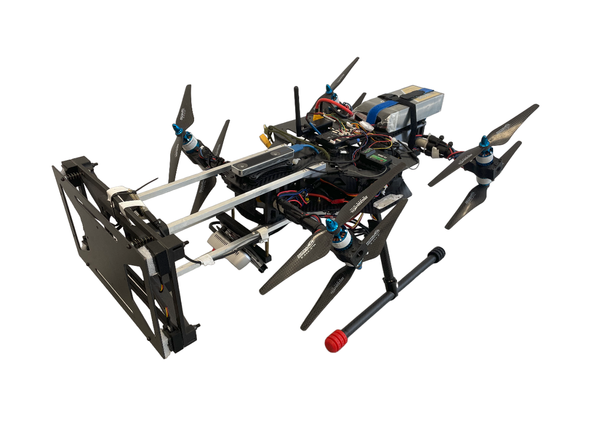

# baby_k – Tilting UAV with H-Configuration Manual Operation Guide

{ width="420" }

## Overview

The **baby_k** is a tilting unmanned aerial vehicle (UAV) featuring an **H-configuration with 8 coaxial rotors**.
This configuration provides enhanced stability and redundancy through coaxial motor pairs and a tilting mechanism for advanced flight operations.
---