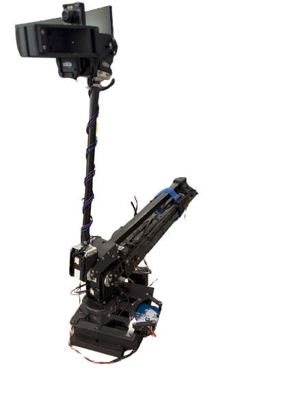

# S.W.A.N. - Manual Operation

{ width="420" }

## Overview

S.W.A.N. is a custom manipulator designed as equipment for the ANYmal quadruped robot. It is intended to support field operations in agricultural environments, where a mobile legged platform can carry manipulation capabilities across uneven terrain.

## Platform Type

- Category: Manipulator
- Platform: ANYmal
- Application: Agricultural field operations
- System owner: TBD
- Last validated: TBD

## Safety Requirements

- Keep clear of the manipulator workspace and the ANYmal operating area.
- Verify the end-effector and mounting interface before operation.
- Use reduced speed during initial tests and while operating near crops or people.
- Confirm that the combined ANYmal and S.W.A.N. system is stable before moving the arm.

## Pre-Operation Checklist

- [ ] Manipulator, mounting structure, and end-effector inspected
- [ ] ANYmal battery and power status checked
- [ ] Manipulator controller and ANYmal communication link verified
- [ ] Joint limits, collision settings, and emergency stop validated
- [ ] Agricultural work area cleared and operation boundaries defined

## Startup Procedure

1. Power on ANYmal and the S.W.A.N. manipulator controller.
2. Start the required robot control software and communication services.
3. Confirm that the manipulator is correctly mounted and available.
4. Check the combined system state before enabling motion.

## Basic Operation

1. Move ANYmal to the designated agricultural work area.
2. Select the approved manipulation task and end-effector configuration.
3. Execute a low-risk test motion before starting the field operation.
4. Monitor the robot posture, terrain conditions, and manipulator state throughout the task.

## Shutdown Procedure

1. Stop the active manipulation task.
2. Return the manipulator and ANYmal to a stable safe state.
3. Disable motion and power off the S.W.A.N. controller.
4. Power off or secure ANYmal according to the platform procedure.

## Troubleshooting

- Problem: Manipulator motion unavailable
- Check: Mounting interface, controller state, communication link, and emergency stop
- Action: Disable motion, inspect the combined system, and restart only after the fault is cleared

## Maintenance Notes

- Daily checks: Mounting points, joints, end-effector, cables, and collision status
- Weekly checks: Calibration, firmware, and mechanical fasteners
- Critical consumables: Batteries and task-specific end-effectors

## Change Log

- 2026-09-24: Initial placeholder version.
