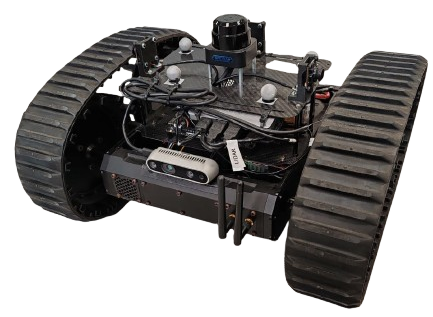

# Rover – Power, NUC Setup, and Connection Guide

## Powering On the Rover

To power on the rover, connect the **22.2 V battery** to the power connector located on the **rear side of the rover**, on the **first level**.

Follow this procedure:

1. On the rear side of the rover, disconnect the **Wi-Fi dongle cable**.
2. Insert the battery, making sure the battery cable is positioned so that it can be conveniently connected afterward.
3. Connect the battery to the dedicated power connector.
4. Reconnect the **Wi-Fi dongle cable**.

---

## Powering On the NUC

Once the battery is connected, the **NUC onboard computer** can be powered on.

To power on the NUC:

1. Locate the **power button** on the **NUC case**.
2. The NUC is positioned on the **front side of the first level** of the rover.
3. Press the power button to start the onboard computer.

---

## Alternative NUC External Power Supply

The NUC can also be powered using its **external power supply** instead of the rover battery.

The NUC power supply is stored inside the **Intel NUC cardboard box**, located in the **HARDWARE and ELECTRONICS cabinet**.

To power the NUC from external power:

1. Locate the NUC power connector on the **left side of the NUC**.
2. Disconnect the **yellow-and-black cable**.
3. Connect the cable from the **external NUC power supply**.

The NUC box also contains a **mini HDMI cable**, which can be used to connect the NUC to a monitor.

---

## Hardware Notes

- The **first USB port on the upper-left side** is **not working**.
- The **Ethernet port** used for the **LiDAR** is **loose** and may cause connection problems.  
  Always verify that the cable is properly connected.

---

## NUC Access and Docker Images

The password for the NUC is:

- **`nuc`**

The most up-to-date Docker image currently available is:

- **`Livox`**

On the NUC desktop, the guide **`Docker_image_guide`** contains:

- the list of all available Docker images
- the corresponding source code folders

A dedicated Docker image for rover teleoperation is also available:

- **`tele_rover`**

After startup, check whether a container named **`start`** is launched automatically.  
If it is running and not needed, stop or close it.

---

## SSH Connection

It is possible to connect to the NUC via SSH.

When connected through **PrismaArena**, use the following IP address:

- **`192.168.3.10`**